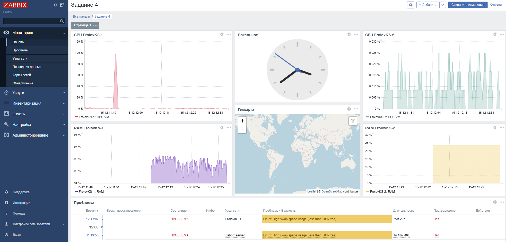

# monitoring2-

# Домашнее задание к занятию "`Система мониторинга Zabbix. Часть 2`" - `Фролов КС`"

### Задание 1
Создайте свой шаблон, в котором будут элементы данных, мониторящие загрузку CPU и RAM хоста.

 Прикрепите в файл README.md скриншот страницы шаблона с названием «Задание 1»

 #### Ответ: 

### Задание 2
Добавьте в Zabbix два хоста и задайте им имена <фамилия и инициалы-1> и <фамилия и инициалы-2>. Например: ivanovii-1 и ivanovii-2.

#### Требования к результату
1. Результат данного задания сдавайте вместе с заданием 3

#### Задание 3
Привяжите созданный шаблон к двум хостам. Также привяжите к обоим хостам шаблон Linux by Zabbix Agent.

#### Требования к результату
 1. Прикрепите в файл README.md скриншот страницы хостов, где будут видны привязки шаблонов с названиями «Задание 2-3». Хосты должны иметь зелёный статус подключения

#### Ответ задание 2-3

### Задание 4
Создайте свой кастомный дашборд.
#### Требования к результату
- [ ] Прикрепите в файл README.md скриншот дашборда с названием «Задание 4»

#### Ответ:

